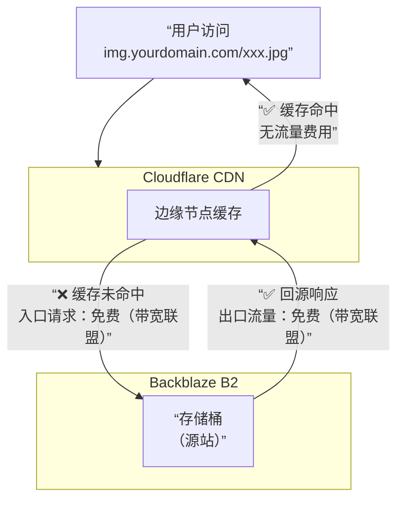
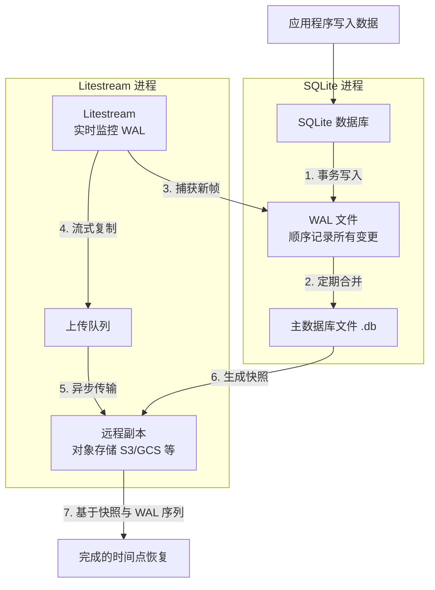
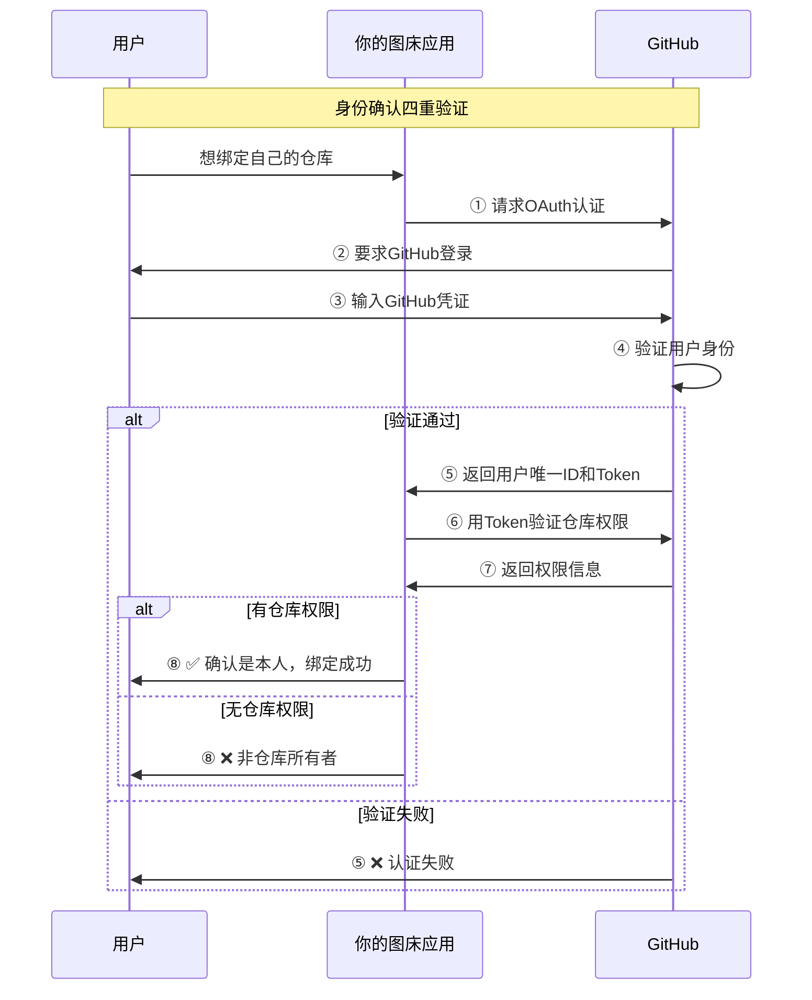

:::tip
Mermaid 打开方式：https://mermaid.live
:::

## CF-Proxy-B2

https://github.com/hoochanlon/CF-Proxy-B2

由于 Cloudflare 和 Backblaze 都属于 Bandwidth Alliance（带宽联盟），因此从 Cloudflare 回源到Backblaze B2（即“入口流量”）也是完全免费的。

简单来说，这套方案的免费流量模式是：

* 出口流量免费：Backblaze B2 → Cloudflare CDN
* 入口流量免费：Cloudflare CDN → Backblaze B2

## keep-alive

https://github.com/hoochanlon/keep-alive

zeabur 免费：1 CPU，2G 内存，每月5美元重置，硬盘 $0.2/GB 月，网络输出费用 $0.1/GB

* 详情见：https://zeabur.com/docs/zh-CN/billing/pricing 。
* 或用 B2 S3 提供存储数据支撑 [tenten - 比較 Cloudflare R2 與 AWS S3，Blaze B2](https://university.tenten.co/t/cloudflare-r2-aws-s3-blaze-b2/1641)

采用 [hu3rror/memos-litestream](https://github.com/hu3rror/memos-litestream) 该方案，并结合 B2，既能满足可用存储充足，又能将个人账号基础数据备份，以及使用 [hoochanlon/CF-Proxy-B2](https://github.com/hoochanlon/CF-Proxy-B2) 达到免流目的。

Litestream 备份流程，解决了 serverless 备份限制的痛点

## picx-images-hosting

https://github.com/hoochanlon/picx-images-hosting

### GitHub OAUTH

